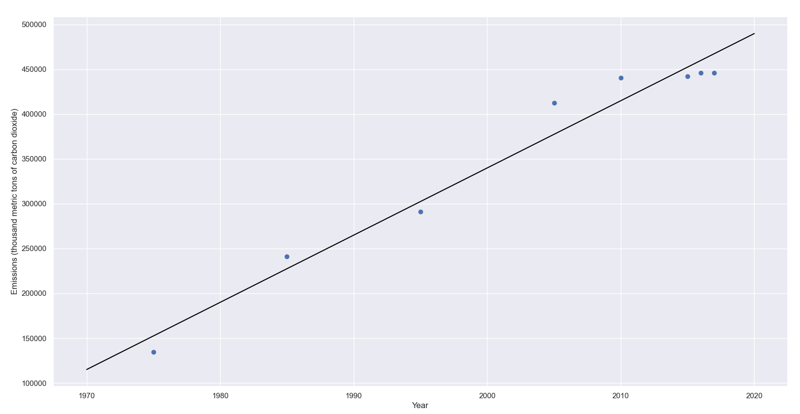
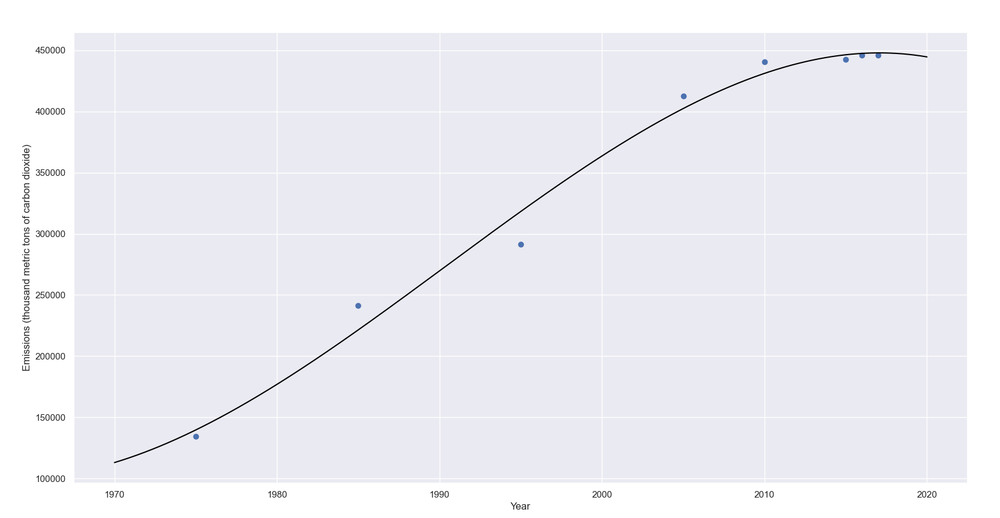
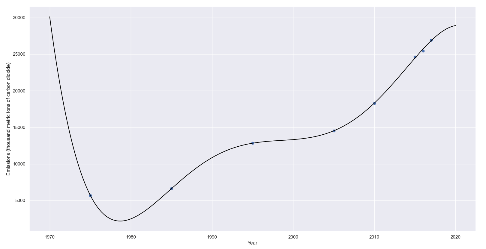
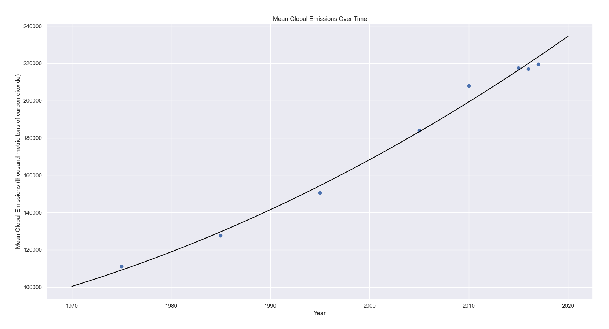
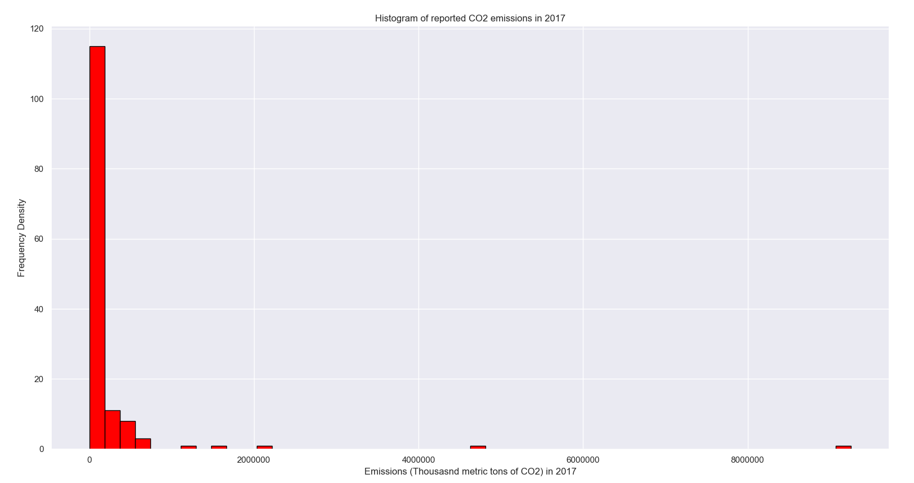
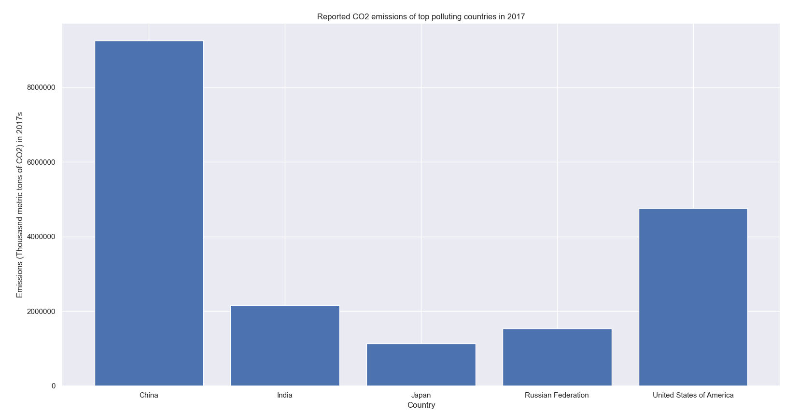
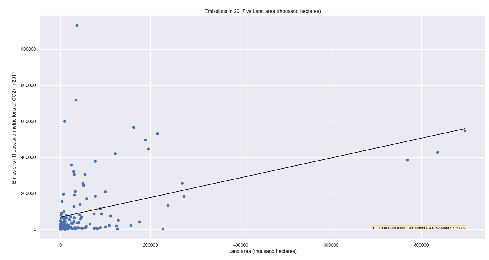
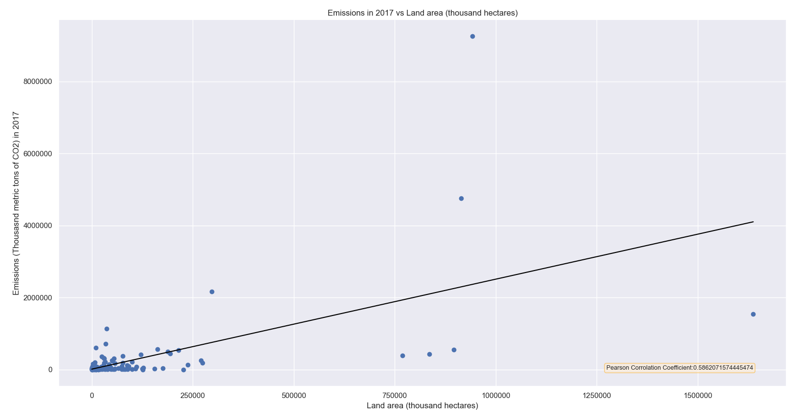
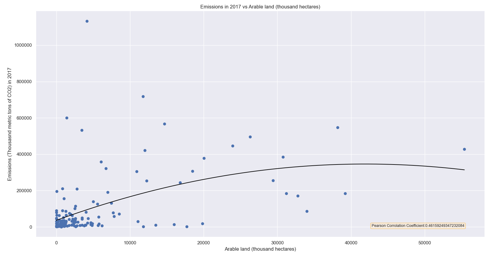

# Display of Environmental Data

## Section 1 - The Data

We have two datasets which are being analyzed in this project.

The first is "Carbon Dioxide Emission Estimates.csv". This dataset has four columns - "Country", "Year", "Series", and "Value".
Here, we have focused on entries where "Series" - that is, what the "Value" represents - is "Emissions (thousand metric tons of carbon dioxide)". This is the emissions reported for a given year by a given country.

The second is "Land.csv". This dataset has the same four columns (though "Countries" is called "Land"), and we analyze all series in this dataset.

These datasets form the basis of our analysis and will be the focus throughout

## Section 2 - Data by Country

The first section is the "Data by Country" functionality of the code. This section takes as an input the name of a country, and will show said country's reported carbon emissions from 1970 until 2017. We also allow the input of the degree of best fit to be used, using linear regression to provide a line of best fit of said degree to the graph. Below you can see the code used to achieve this:


```python
def Regression_Selector(X, Y, Min, Max):
    degree = int(input("What degree of best fit would you like?"))
    print("Degree = ", degree)
    coeffs = np.polyfit(X, Y, deg=degree)
    K = np.linspace(Min, Max, Max*10)
    M = 0
    for x in range(len(coeffs)):
        M += coeffs[x] * K ** ((len(coeffs) - x) - 1)
    return(K, M)
```

You can see the result for Mexico below, with degrees 1 and 3 respectively:



In use, the country name must be entered exactly as written in "Carbon Dioxide Emission Estimates.csv", and so the program is caps sensitive (for example, "Canada" rather than "canada"), and certain countries must be referred to by their full title (such as "Russian Federation", or "United States of America")

Higher degrees of regression can also lead to "overfitting". We can see that taking a degree of 8 for Lebanon results in the following:


This is clearly overfit, as we can see excessive curves between the points (the most egregious example being between 1975 and 1985, dropping below 5000 though clearly no data shows that this would be the case). This can occur whenever a high degree is chosen, but the option is there should the user decide that a degree greater than 2 or 3 is desirable

## Section 3 - Global Data

This section is a more straightford depiction of the Carbon Emissions dataset. Upon selection of a degree of best fit, we get presented with 3 graphs.




The first shows the progression of the global mean carbon emissions from 1970 until 2017. It uses regression analysis to show the increasing trend over time, the above showing a quadratic curve



The second shows us a histogram of the reported CO2 emissions in 2017. This clearly shows that a few countries are responsible for a very large amount of the global carbon emissions. This histogram inspired the third and final chart:



The final graph names the top 5 polluting countries in 2017 according to the dataset. This  shows which countries are the small bars in the histogram in the higher values.

## Section 4 - Land + Correlation

Our third and final function is the correlation section. Upon selecting this, we will be given a list of all land types in the land.csv file. The list is as follows:

*Land area (thousand hectares)*

*Arable land (thousand hectares)*

*Permanent crops (thousand hectares)*

*Forest cover (thousand hectares)*

*Arable land (% of total land area)*

*Permanent crops (% of total land area)*

*Forest cover (% of total land area)*

*Important sites for terrestrial biodiversity protected (% of total sites protected)*

We will then be prompted to copy one of these options for our selection, and whether or not to exclude extreme values. This option is present to prevent the extremely high-polluting countries from affecting our correlation data. Specifically, countries are excluded who's pollution is 1500000 or more in 2017. 

Upon choosing whether or not to exclude extreme values, we will be presented by the Pearson Correlation Coefficient for carbon emissions in 2017 vs the amount of land of the type selected. The code to generate such a value is shown below:


```python
def Pearson_correlation(X,Y):
    if len(X) == len(Y):
        Sum_xy = sum((X-X.mean())*(Y-Y.mean()))
        Sum_x_squared = sum((X-X.mean())**2)
        Sum_y_squared = sum((Y-Y.mean())**2)       
        corr = Sum_xy / np.sqrt(Sum_x_squared * Sum_y_squared)
    return(corr)
```

We will now be asked for a degree of best fit, and a graph will be generated showing us how different countries' pollution compares to their land usage. Below are a few examples:


*Land area correlation with extreme values excluded and a linear line of best fit*


*Land area correlation with extreme values not excluded and a linear line of best fit*


*Arable land (thousand hectares) with extreme values excluded and a quadratic line of best fit*


```python

```
